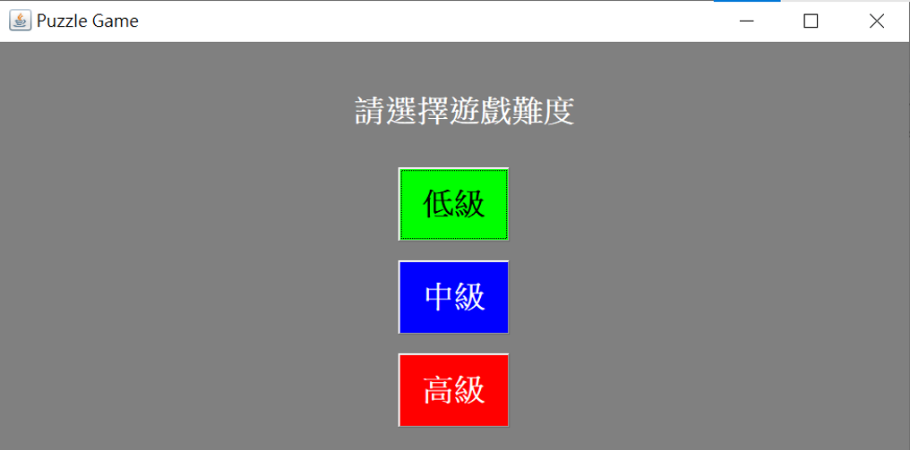
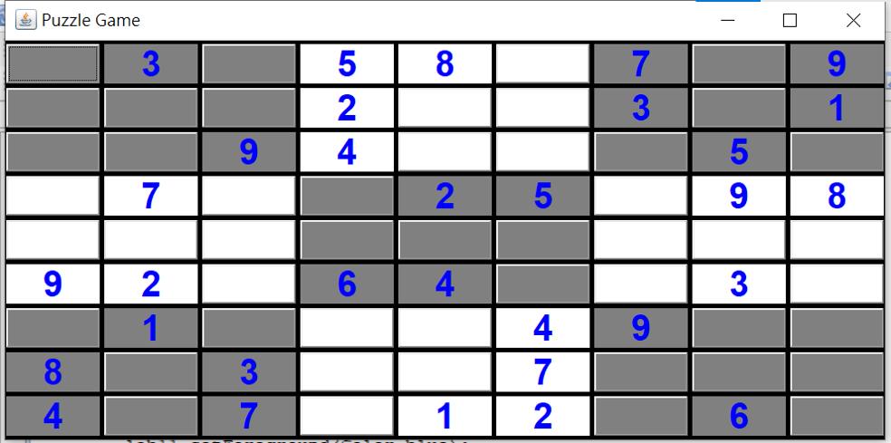
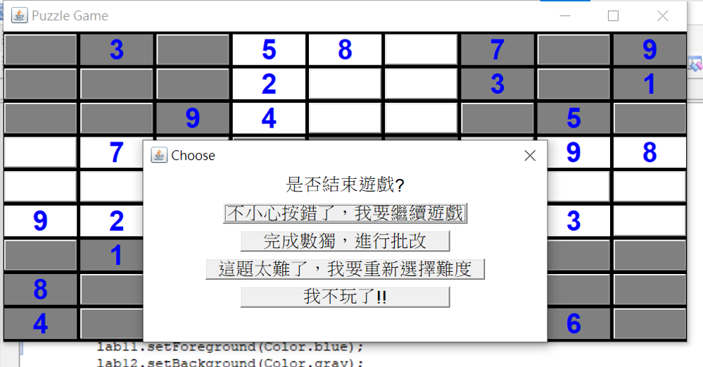

# Java-Sudoku-Game
Java 數獨小遊戲

## Abstract  
This work aims to develop an **Java AWT window** and create a Sudoku Game, with the functions of choosing difficulity, modifying answer, solution auto-generation, etc.

## Instruction  
Step.01  Executing the program.  
This will pop up a "Puzzle Game" window.  

Step.02  Select the game difficulty.  
After pressing the button, a dialog box will pop up providing a choice of features for the game.  

Step.03  Press the START button to maximize the original Puzzle Game window and to get Sudoku questions.  

Step.04  Fill in Sudoku.  
The blank space is a button. If you want to fill in the number, press the button. It will pop up the dialog window to provide a number selection.  

Step.05  If you complete the answer, press the Close Window button of Puzzle Game. The selected item will pop up.  

## Features
- Choose of Dificulity
- Game Description (which can be viewed by clicking the button)
- After completing the answer, the player can decide whether they want to continue modifying the answer, marking it, or reselecting the difficulty.
- DFS generates standard solutions to Sudoku
- Leaving the game at any time during use
