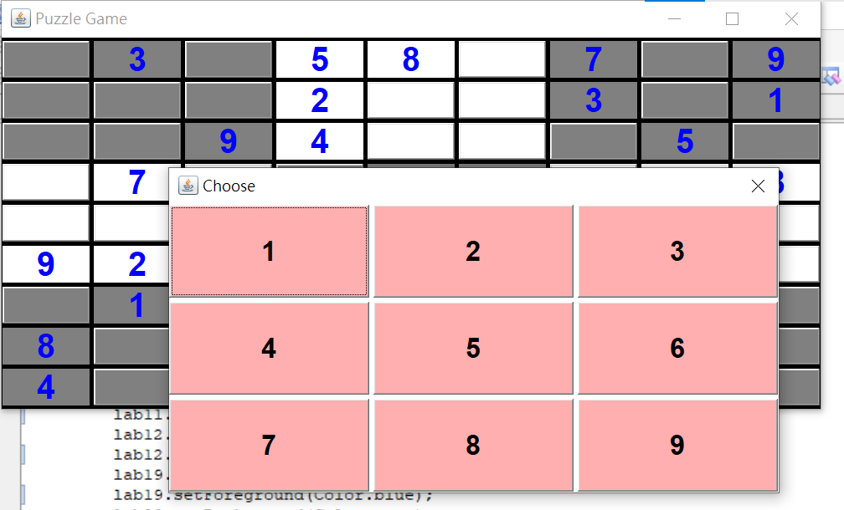

# Java-Sudoku-Game
Java 數獨小遊戲

## Abstract  
This work aims to develop an **Android App** with accounting and expenditure management functions, combined with the caulator project I established before. This app cam manually calculate income and expenditure, and the amount of money also can be added at any time in the accounting process.

## Instruction  
Step.01  Executing the program.
This will pop up a "Puzzle Game" window.

Step.02  Select the game difficulty.
After pressing the button, a dialog box will pop up providing a choice of features for the game.

Step.03  Press the START button to maximize the original Puzzle Game window and to get Sudoku questions.

Step.04  Fill in Sudoku.  
The blank space is a button. If you want to fill in the number, press the button. It will pop up the dialog window to provide a number selection.

Step.05  If you complete the answer, press the Close Window button of Puzzle Game. The selected item will pop up.

